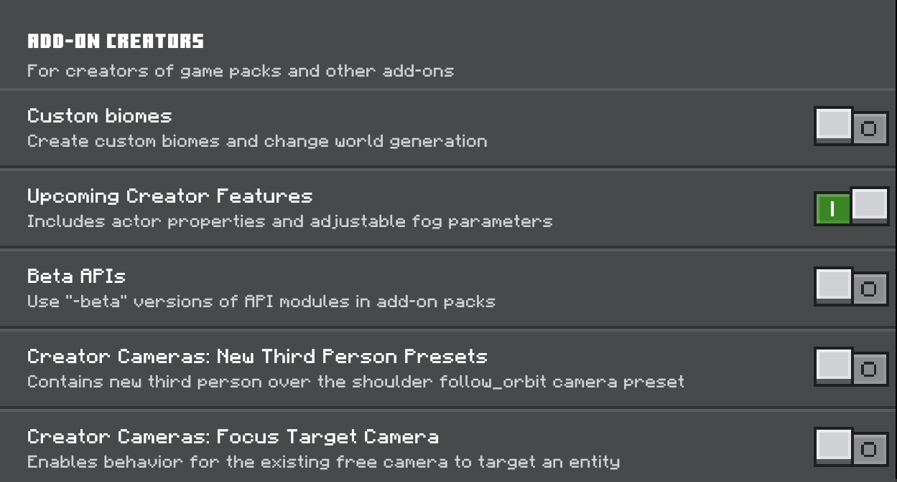

 

### Downloads
<a href="https://github.com/S3XT4-Studio/Age-of-Berk-Add-on-Information/releases/download/v1.5.2/Age.of.Berk.Test.v1.5.2.mcaddon">Test v1.5.2 Add-on</a>
 
<a href="https://github.com/S3XT4-Studio/Age-of-Berk-Add-on-Information/releases/download/Translation/Dragoes.de.Berk.Traducao.para.portugues.mcaddon">Tradução de teste</a>
 
### Version History
Go to [Version History](/versions.md) to read changelogs and see release dates
 

### Necessary Experiments
Without these, the add-on will not work.
 
 

 

### Installation

#### Windows
 
- Open File Explorer and double-click the file that you downloaded. It should open Minecraft.
 
- Once it says "Import Successful", the add-on can then be installed on a new world. Simply add the behavior pack and resource pack in the world creation menu.

#### Android
- Go to the Settings app and select Storage > Explore (at the bottom). If you do not have a settings app, you can install a file explorer app like ES File Explorer.
 
- Select the directory where you saved the file, usually "Download". Select the file, and the add-on should open in Minecraft
 
- Once it says "Import Successful", the add-on can then be installed on a new world. Simply add the behavior pack and resource pack in the world creation menu.

#### iOS
- There is currently a bug with importing add-ons on iOS. Please see [iOS Import Errors](/ios.md) for a workaround.
