Please report bugs at [this link](https://docs.google.com/forms/d/1Wi3go3pZFQaGHhHvkKgHEykInerdWlRazn41bpYdGGI/edit#responses), after checking the list of known bugs [here](/bugs.md).

## Dragon Behavior

Training

Almost every dragon can be trained, but it is different for every dragon.
  
  
Most dragons can be tamed by feeding them cod or salmon, but there are exceptions. 
  
- Boulder Class dragons can be tamed with a variety of rocks, instead of fish. However, the type of rock depends on the dragon.
  
- Some dragons eat different foods based on where they live. 
  
  
Check the Book of Dragons if you are unsure of how to train a specific dragon.
 

Riding

Most tameable dragons can be ridden and flown
  
  
To mount a dragon, interact with it.
  
  
To control your dragon, you need a dragon saddle. These can be crafted using this recipe:
 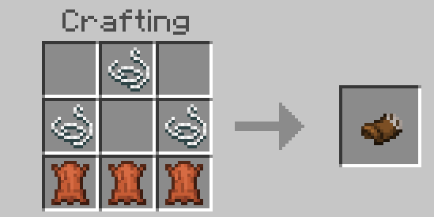

  
  
When on a dragon, you can hold down the jump button to travel up and let go to travel down.
  
Use your normal movement controls to move other directions.
  
  
While riding a dragon, you can make it breathe fire. There is a 10 second cooldown between shots
  
- On touch controls, tap the circle in front of you when it turns green to shoot fire in the direction you are looking
  
- On keyboard/mouse or console controller, attack to shoot fire in the direction you are looking
  

Sitting

Every tameable dragon can sit. When sitting, a dragon will not follow you.
  
  
To make a dragon sit, you must be crouching/sneaking. You then interact with them, as if you were going to ride them.
  
The dragon will play a sitting animation, and will be unable to move, whether under its own control or yours.

Breeding

Every tameable dragon can breed as an adult.
  
  
To make a dragon breed, you must have two trained adult dragons of the same type*. Feed them the same food you would train them with**. They will then breed, and lay an egg. 
 
 
 *The only exception are Night Furies and Light Furies, which breed to create a hybrid Night Light.
 
 **Skrills are bred with raw cod or raw salmon, despite being tamed with iron.
 
 
When the egg hatches, an untrained baby dragon will appear. Train it, and then wait for it to grow up, or feed it more food to make it grow up faster!
  
 

## Normal Dragons

Deadly Nadder

 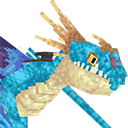
 
This Tracker Class dragon is protective, but can be tamed at any age using the following foods:
 
 - Raw Cod
 
 - Raw Salmon
 
 - Raw Chicken
 
 - Cooked Chicken
 
 
Deadly Nadders love Cooked Chicken, and can fly almost twice as fast for a short time after being fed it.
 
 
Nadders can shoot sustained blasts of fire when ridden. The fire is hot enough to set most materials ablaze.
 
 
This dragon can be found in Dragon Cages

Gronckle

 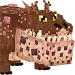
 
This Boulder Class dragon is protective, but can be tamed at any age using the following foods:
 
 - Stone
 
 - Cobblestone
 
 - Tuff
 
 - Deepslate
 
 - Cobbled Deepslate
 
 - Andesite
 
 - Diorite
 
 - Granite
 
 
Gronckles can shoot lava blasts when ridden. The lava blast is hot enough to set most materials ablaze.
 
 
This dragon can be found in Dragon Cages

Monstrous Nightmare

 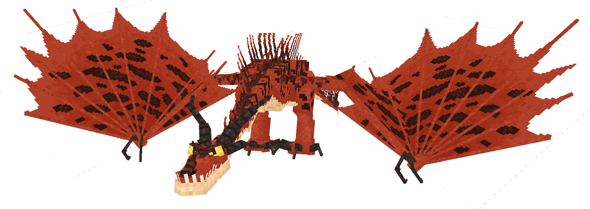
 
This Stoker Class dragon is protective, but can be tamed at any age using the following foods:
 
 - Raw Cod
 
 - Raw Salmon
 
 
Nightmares can shoot sustained blasts of fire when ridden. The fire is hot enough to set most materials ablaze.
 
 
You can interact with a nightmare while holding an empty bottle to harvest some Monstrous Nightmare Gel, which can be used to craft the Dragon Blade. The Dragon Blade can be ignited by using it, and will set enemies ablaze as if enchanted with Fire Aspect.

Hideous Zippleback

 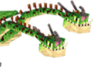
 
This Mystery Class dragon is protective, but can be tamed at any age using the following foods:
 
 - Raw Cod
 
 - Raw Salmon
 
 
Zipplebacks can shoot gas explosions when ridden. They explode with much damage, but do not cause fire or destroy blocks.
 
 
Zipplebacks can be ridden by 2 players. They can both shoot with their own cooldown, but only the player on the left head can control the dragon.

Night Fury

 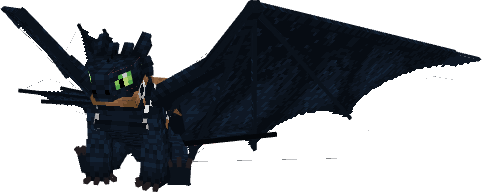
 
This Strike Class dragon is protective, but can be tamed using the following foods:
 
 - Raw Cod
 
 - Raw Salmon
 
 
Night Furies can shoot plasma blasts when ridden. The fire is hot enough to set most materials ablaze.
 
 
Only one night fury will spawn at a time, and until that night fury is trained, you will not find another. This makes them incredibly rare to find.

Light Fury

 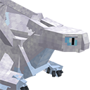
 
This Strike Class dragon is protective, but can be tamed using the following foods:
 
 - Raw Cod
 
 - Raw Salmon
 
 
Light Furies can shoot plasma blasts when ridden. The fire is hot enough to set most materials ablaze.
 
 
Light Furies do not spawn naturally, and can rarely be found in dragon cages.

Night Lights

 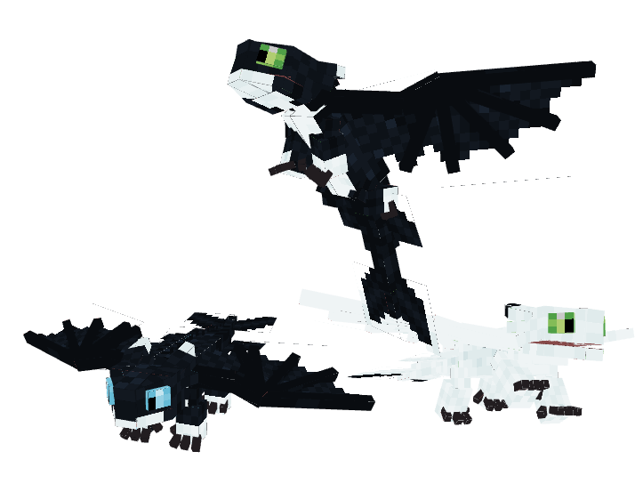
 
This Strike Class dragon is passive, and can be tamed using the following foods:
 
 - Raw Cod
 
 - Raw Salmon
 
 
Night Lights remain cute and little forever, that is, they never grow up.
 
 
They cannot spawn naturally, and can only be obtained by breeding a rare Light Fury and even rarer Night Fury together. 

Whispering Death

 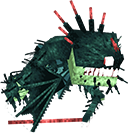
 
This Boulder Class dragon is extremely aggressive, and can only be trained as a baby, with the following foods
 
 - Stone
 
 - Deepslate
 
 
Whispering Deaths emerge from beneath, and will become immediately hostile to players and wandering traders it sees.
 
 
Nadders can shoot rings of fire when ridden. The fire is hot enough to set most materials ablaze.
 
 

Thunderdrum

 
 
This Tidal Class dragon is defensive, but can be tamed using the following foods:
 
 - Raw Cod
 
 - Raw Salmon
 
 
Thunderdrums spawn in the ocean. They are skilled swimmers, and can even swim with a rider. Just remember a water breathing potion!
 
 
Thunderdrums do not have a fire. Instead, they can emit a strong knockback attack that does no damage, but sends all enemies within a certain distance flying far away! They will attack everything in sight when they are attacked, so don't be nearby when they are angry!
 
 

Sand Wraith

 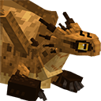
 
This Tidal Class dragon is protective, but can be tamed using the following foods:
 
 - Raw Cod
 
 - Raw Salmon
 
 
Sand Wraiths spawn anywhere where there is sand for them to hunt in. The Sand Wraith is peaceable, unless attacked of course.
 
 
Sand Wraiths shoot a ball of molten sand that, while very warm, will not set blocks on fire.
 
 

Timberjack

 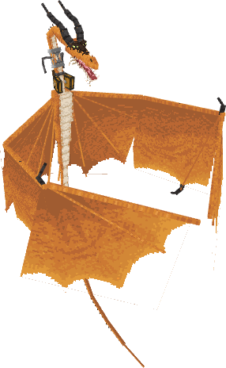
 
This Sharp Class dragon is protective, but can be tamed using the following foods:
 
 - Raw Cod
 
 - Raw Salmon
 
 
Timberjacks spawn in biomes with 2x2 spruce trees.. They are peaceable, unless attacked of course.
 
 
Timberjacks can shoot sustained blasts of fire when ridden. The fire is hot enough to set most materials ablaze.
 
 

Flame Whipper

 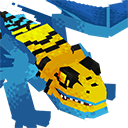
 
This Stoker Class dragon is aggressive, and can be tamed as a baby with the following foods:
 
 - Raw Cod
 
 - Raw Salmon
 
 
Flame Whippers spawn in jungles, and will seek out players to attack.
 
 
Flame Whippers can shoot poison fireballs, that give the poison and slowness effect to its target. While the fire is not hot enough to cause fire, they are still very dangerous.
 
 

Skrill

 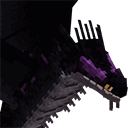
 
This Strike Class dragon is extremely aggressive, and can only be tamed during extreme weather. They can be be tamed using the following items:
 
 - Iron Nugget
 
 - Iron Ingot
 
 - Iron Block
 
 
Skrills spawn in Jagged Peaks biomes, where they are closest to the lightning. They are aggressive to any players, unless it is raining.
 
 
Skrills can shoot lightning blasts that will electrocute anything unlucky enough to be hit by them. They are very dangerous.
 
 

Hobblegrunt

 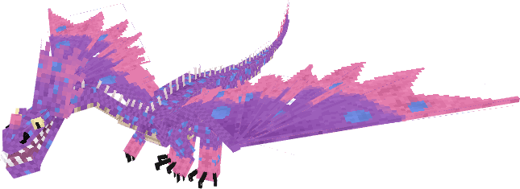
 
This Stoker Class dragon is passive, and can be tamed using the following foods:
 
 - Raw Cod
 
 - Raw Salmon
 
 
Hobblegrunts can shoot sustained blasts of fire when ridden. The fire is hot enough to set most materials ablaze.
 
 

Rumblehorn

 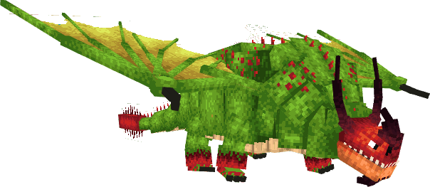
 
This Tracker Class dragon is protective, and can be tamed using the following foods:
 
 - Raw Cod
 
 - Raw Salmon
 
 
Rumblehorns can shoot fireballs when ridden. The fire is hot enough to set most materials ablaze.
 
 

Buffalord

 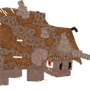
 
This Mystery Class dragon is passive, and cannot be tamed. They simply wander around, eating grass and enjoying their life
 
 
Buffalords spawn wherever there is grass for them to eat
 
 

## Special Dragons
This category include special variants and seasonal dragons

Icy Gronckle

 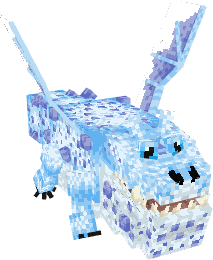
 
This special variant of a Gronckle can only spawn in icy biomes during the month of December, or using a spawn egg any time of the year.
 
 
They behave as normal Gronckles
 

Pale Nightmare

 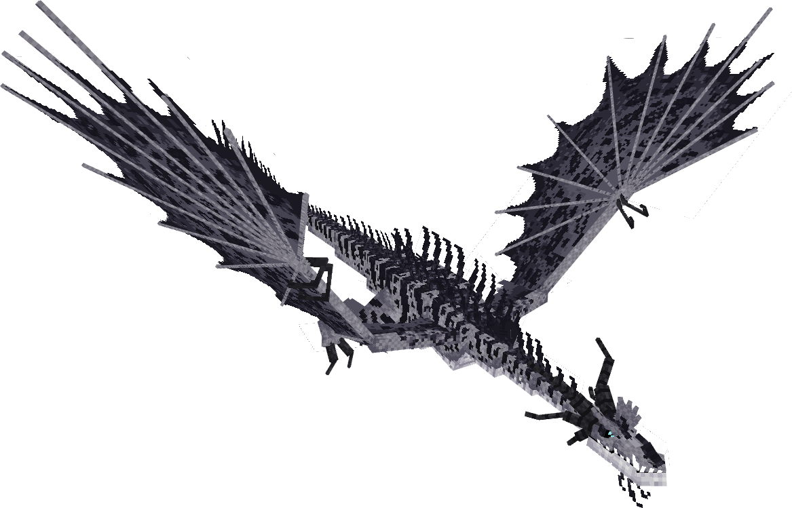
 
This special variant of a Monstrous Nightmare can only spawn in the Pale Garden biome.
 
 
They behave as normal Montrous Nightmares.
 

## Other Mobs

Dragon Hunter

This new type of illager will only attack players when provoked, but attacks dragons on sight.
  
  
Their hate of dragons causes most of them to attack the Hunters on sight. Their arrows prevent a dragon from flying for up to a minute, preventing a hasty escape.
  

## Structures

Dragon Hunter Ship

 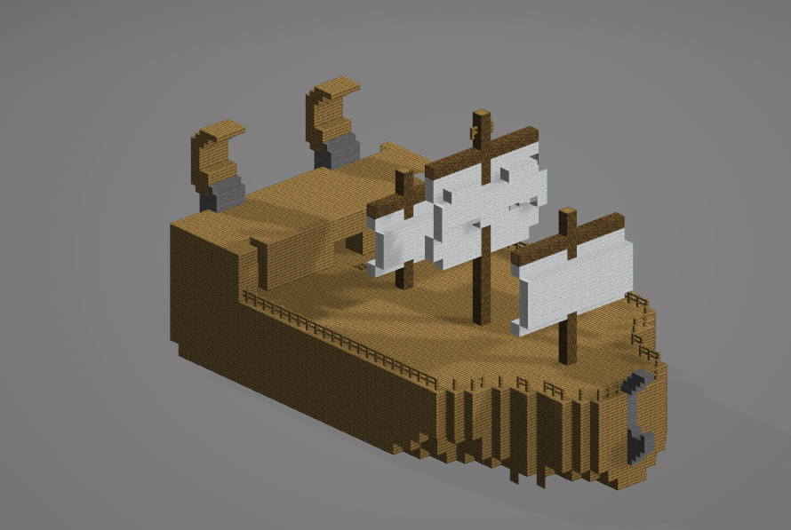
 
These ships are crawling with Dragon Hunters.
  
  
Cages can be found on ships, which can only be opened using a cage key. A cage key can be found rarely on a Dragon Hunter Ship, but much more commonly in Hunter Watchtowers, where there are guaranteed to be at least 4.
  
Loot on these ships includes arrows, bows, dragon eggs, crossbows, emeralds, pottery sherds, cage keys, and much more.
  

Hunter Watchtower

 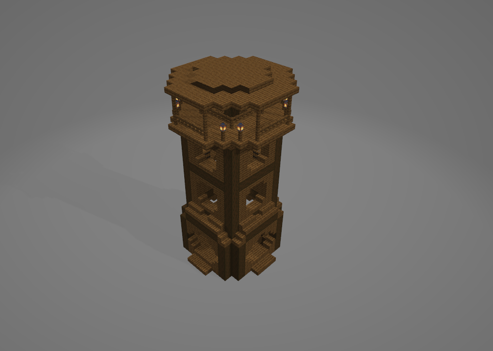
 
Hunter Watchtowers can be found in most biomes, and are filled with Dragon Hunters strategizing about their next attack.
  
  
2 cages can be found around watchtowers, which can only be opened using a cage key. A cage key can be found rarely on a Dragon Hunter Ship, but much more commonly in Hunter Watchtowers, where there are guaranteed to be at least 4. Keep the extra keys, because cages can also be found on Dragon Hunter Ships
  
Loot in these towers includes arrows, bows, crossbows, dragon eggs, pottery sherds, dragon saddles, and much more.
  

## Video Showcase
(some material may be outdated, not affiliated with S3XT4 Studios)

<iframe
  src="https://www.youtube.com/embed/?listType=playlist&list=PLGq1ll6BVhtXJGGCBka1MuCriUrnHykT2&index=3"
  title="Showcase by Smithy MC"
  width="800"
  height="450"
  allowfullscreen>
</iframe>

<iframe
  src="https://www.youtube.com/embed/?listType=playlist&list=PLGq1ll6BVhtXJGGCBka1MuCriUrnHykT2&index=1"
  title="Showcase by Smithy MC"
  width="320"
  height="180"
  allowfullscreen>
</iframe>
<iframe
  src="https://www.youtube.com/embed/?listType=playlist&list=PLGq1ll6BVhtXJGGCBka1MuCriUrnHykT2&index=2"
  title="Showcase by Smithy MC"
  width="320"
  height="180"
  allowfullscreen>
</iframe>

