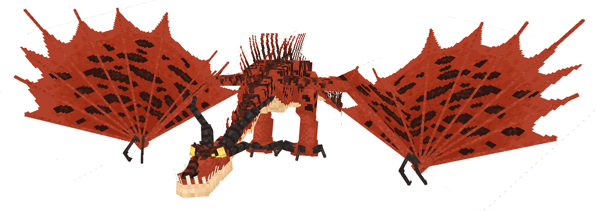

## Dragon Behavior

Training

Almost every dragon can be trained, but it is different for every dragon.
  
  
Most dragons can be tamed by feeding them cod or salmon, but there are exceptions. 
  
- Boulder Class dragons can be tamed with a variety of rocks, instead of fish. However, the type of rock depends on the dragon.
  
- Some dragons eat different foods based on where they live. 
  
  
Check the Book of Dragons if you are unsure of how to train a specific dragon.
 

Riding

Most tameable dragons can be ridden and flown
  
  
To mount a dragon, interact with it.
  
  
When on a dragon, you can hold down the jump button to travel up and let go to travel down.
  
Use your normal movement controls to move other directions.
  
  
While riding a dragon, you can make it breathe fire. There is a 10 second cooldown between shots
  
- On touch controls, tap the circle in front of you when it turns green to shoot fire in the direction you are looking
  
- On keyboard/mouse or console controller, attack to shoot fire in the direction you are looking
  

Sitting

Every tameable dragon can sit. When sitting, a dragon will not follow you.
  
  
To make a dragon sit, you must be crouching/sneaking. You then interact with them, as if you were going to ride them.
  
The dragon will play a sitting animation, and will be unable to move, whether under its own control or yours.

## Individual Dragons

Deadly Nadder

 
This Tracker Class dragon is protective, but can be tamed at any age using the following foods:
 
 - Raw Cod
 
 - Raw Salmon
 
 - Raw Chicken
 
 - Cooked Chicken
 
 
Deadly Nadders love Cooked Chicken, and can fly almost twice as fast for a short time after being fed it.
 
 
Nadders can shoot sustained blasts of fire when ridden. The fire is hot enough to set most materials ablaze.
 
 
This dragon can be found in Dragon Cages

Gronckle

 
This Boulder Class dragon is protective, but can be tamed at any age using the following foods:
 
 - Stone
 
 - Cobblestone
 
 - Tuff
 
 - Deepslate
 
 - Cobbled Deepslate
 
 - Andesite
 
 - Diorite
 
 - Granite
 
 
Nadders can shoot lava blasts when ridden. The lava blast is hot enough to set most materials ablaze.
 
 
This dragon can be found in Dragon Cages

Monstrous Nightmare

 
This Stoker Class dragon is protective, but can be tamed at any age using the following foods:
 
 - Raw Cod
 
 - Raw Salmon
 
 
Nightmares can shoot sustained blasts of fire when ridden. The fire is hot enough to set most materials ablaze.

Hideous Zippleback

 
This Mystery Class dragon is protective, but can be tamed at any age using the following foods:
 
 - Raw Cod
 
 - Raw Salmon
 
 
Zipplebacks can shoot gas explosions when ridden. They explode with much damage, but do not cause fire or destroy blocks.
 
 
Zipplebacks can be ridden by 2 players. They can both shoot with their own cooldown, but only the player on the left head can control the dragon.

## Other Mobs

Dragon Hunter

This new type of illager will only attack players when provoked, but attacks dragons on sight.
  
  
Their hate of dragons causes most of them to attack the Hunters on sight. Their arrows prevent a dragon from flying for up to a minute, preventing a hasty escape.
  

## Structures

Dragon Hunter Ship

Coming in 2 varieties, these ships are crawling with Dragon Hunters.
  
  
Cages can be found on ships, which can only be opened using a cage key. A cage key can be found rarely on a Dragon Hunter Ship, but much more commonly in Hunter Watchtowers, where there are guaranteed to be at least 4.
  
Loot on these ships includes arrows, bows, crossbows, emeralds, cage keys, and much more.
  

Hunter Watchtower

Hunter Watchtowers can be found in most biomes, and are filled with Dragon Hunters strategizing about their next attack.
  
  
2 cages can be found around watchtowers, which can only be opened using a cage key. A cage key can be found rarely on a Dragon Hunter Ship, but much more commonly in Hunter Watchtowers, where there are guaranteed to be at least 4. Keep the extra keys, because cages can also be found on Dragon Hunter Ships
  
Loot in these towers includes arrows, bows, crossbows, emeralds, saddles, and much more.
  

 
